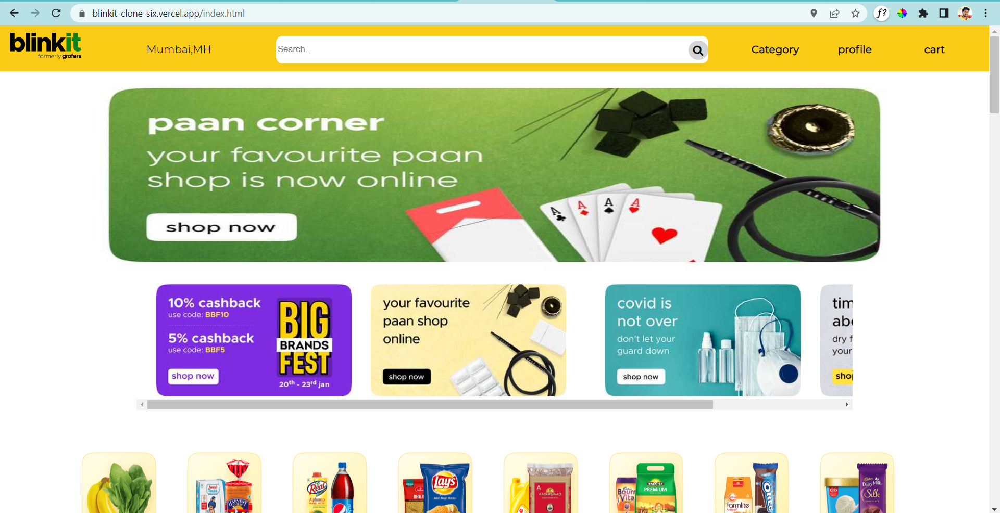
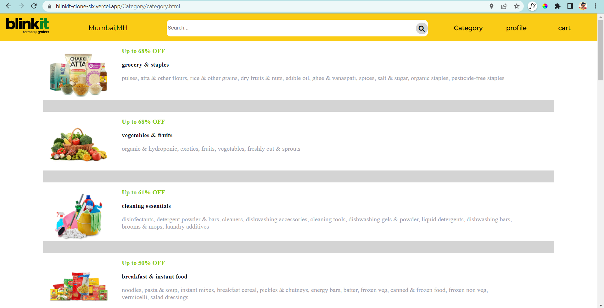
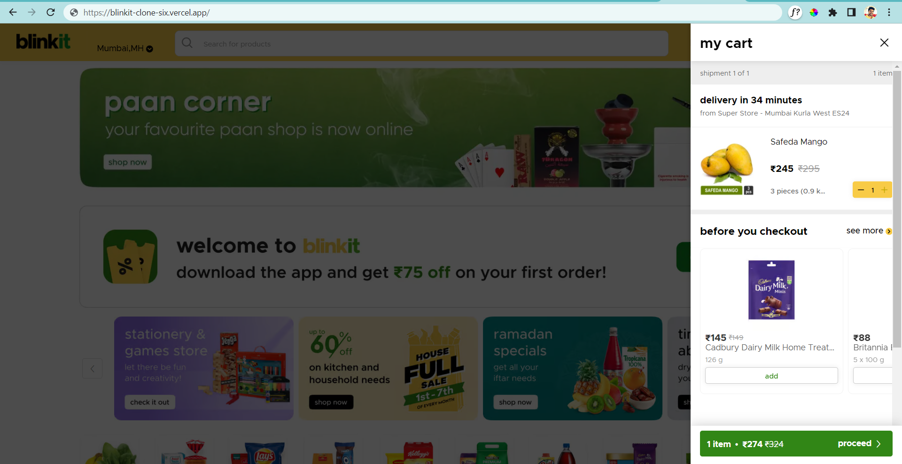
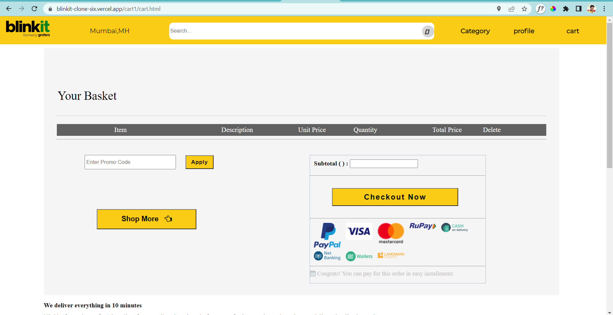
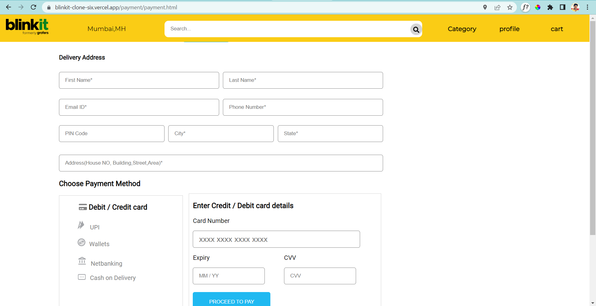

# blinkit-Clone

Blinkit is an Indian instant delivery service which provides a variety of daily needs products
features :
Signup Page.
Login Page.
Cart.
Payment gateway.
Geolocation API.
Searching and Sorting products.

A collaborative project built by a team of 6, executed in 5 days.


### [Original Website](https://blinkit.com/)
### [Deployed Clone](https://blinkitcloneapp.netlify.app/)

### [for Learning Purpose]

## Technologies Used :
* Javascript 
* Css5
* HTML
* REST API
* DOM

## Functionalities Of Website we have Covered :
## User Module :
* Signup Page.
* Login Page.
* Product sorting and filtering
* Cart
* Payment Gateway

# Used In :
#### debouncing
#### fetch API
#### JSON Mock Server


## Getting Started :


### Prerequisites 
* VS Code


### Installation 
* Clone the repository
    ``` 
    https://github.com/PatilVishwaraj/blinkit-Clone.git
    ```

### Website Flow
1. After Starting the Project using npm start. You will see the landing page something similar to the below image.  



2. After that in this page you can select depending on categories.



3. Once you add the products to your cart they will be shown her in the cart.



4. After that you can checkout here to complete the order.



5. Now after filling you right address and payment details your order is booked.


## End Notes 
We have tried our best to give almost all the functionality available on the actual website.

## Contributors :
* [Mithilesh Kumar](https://github.com/mithlesh1203)
* [Vishwaraj Patil](https://github.com/PatilVishwaraj)
* [Siddesh Patil](https://github.com/Coolasid)
* [Shubham bharti](https://github.com/Shubham007-tech)
* [Amit Rai](https://github.com/arai5563)
* [Saurabh Verma](https://github.com/akasaurabhverma)
